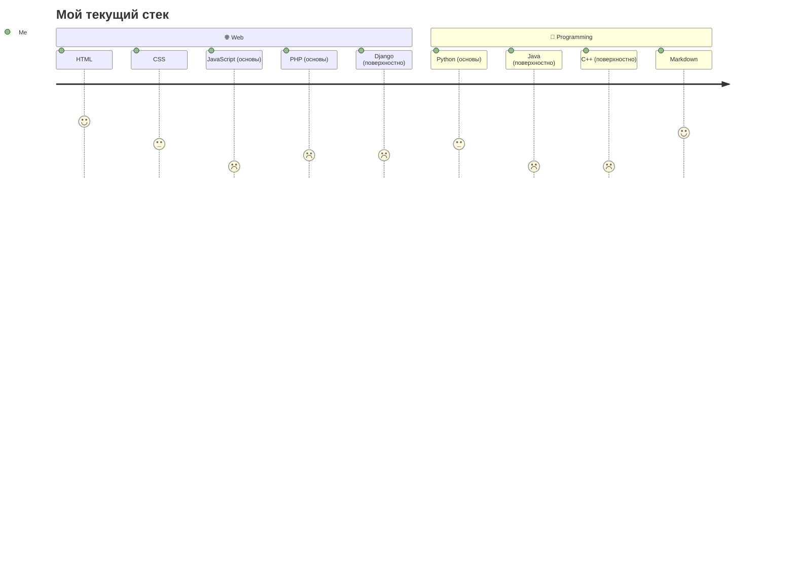
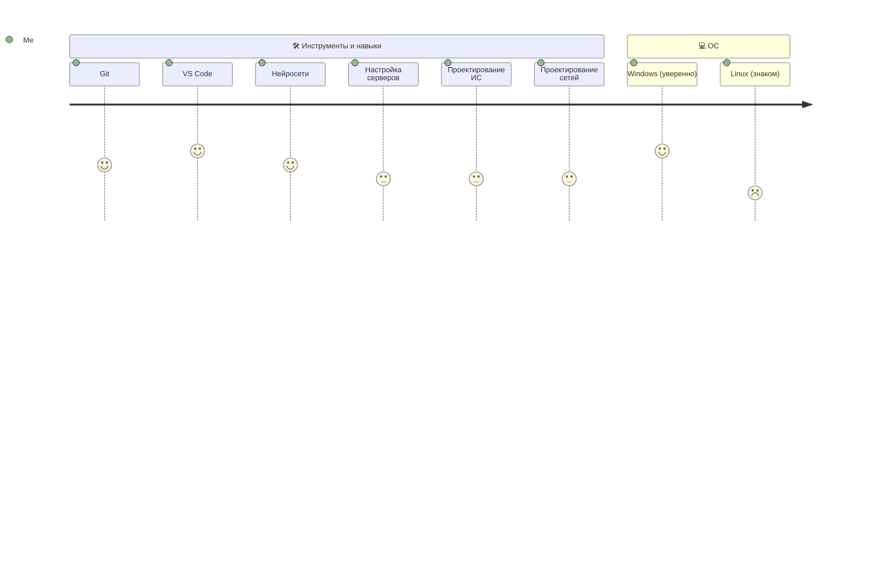

Hi, i'm 
@sttape

> [!Note]
> About me
> I am a college student focusing on web development, programming, and network technologies. I am learning various languages and tools to understand how modern digital products are built — from the user interface to the server-side

