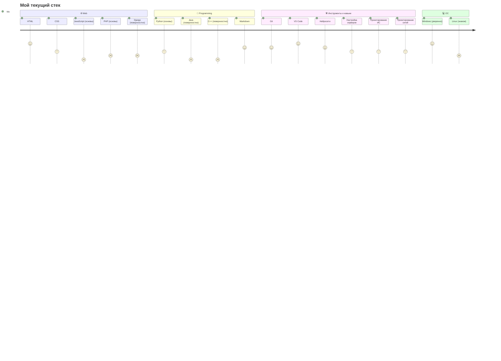
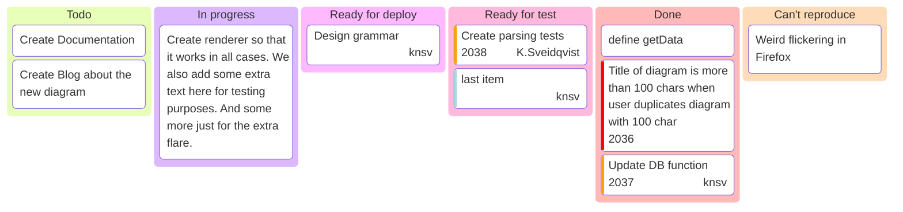

Hi, i'm 
sttape

---

Студент вуза, развиваюсь в направлении веб‑разработки, программирования и сетевых технологий.  
Изучаю разные языки и инструменты, чтобы понимать, как создаются современные цифровые продукты — от интерфейса до серверной части.

