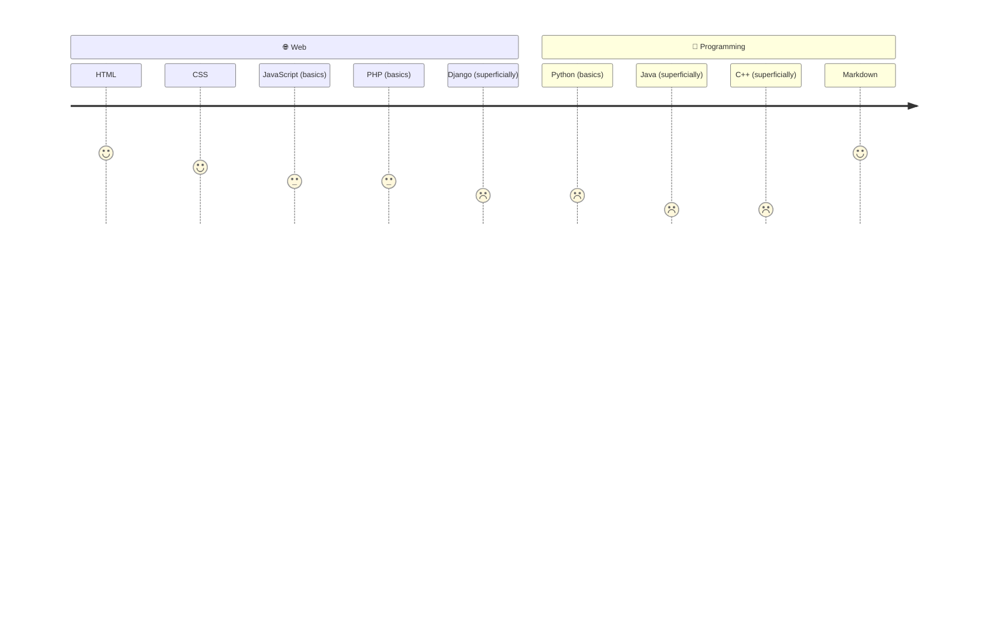
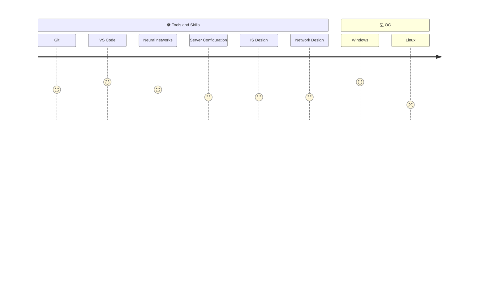

Hi, i'm <h1 align="center">@sttape</h1>

> [!TIP]
> About me: 
> I am a college student focusing on web development, programming, and network technologies. I am learning various languages and tools to understand how modern digital products are built — from the user interface to the server-side

<h3>Links:</h3>
| Command | Description |
| --- | --- |
|  | List all new or modified files |
|  | Show file differences that haven't been staged |

    
  Telegram

    
  Discord

<h3>My stack</h3>

