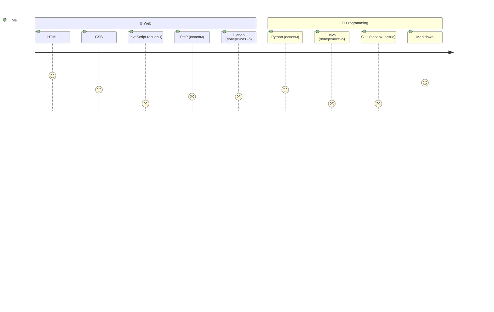
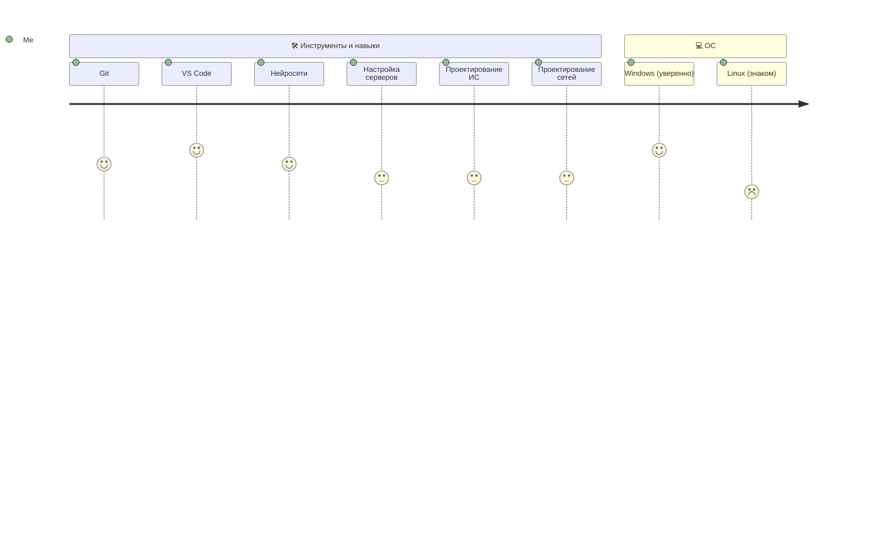

Hi, i'm <h1>@sttape</h1>

> [!TIP]
> About me: 
> I am a college student focusing on web development, programming, and network technologies. I am learning various languages and tools to understand how modern digital products are built — from the user interface to the server-side

<h3>My stack</h3>

